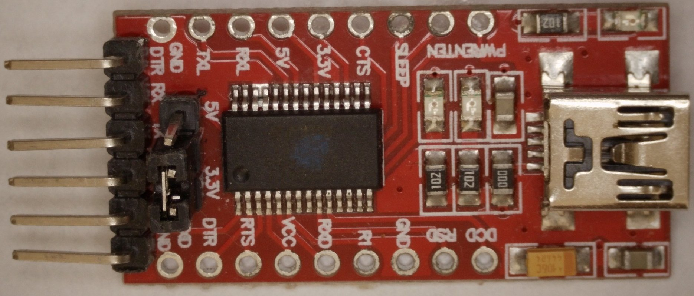
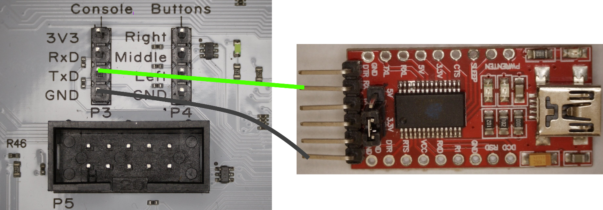

# Wiederbelebung eines Commodore C64 Ultimate

Die folgende Anleitung zeigt die notwendigen Schritte um einen gebrickten Commodore C64 Ultimate (C64U) wieder zu beleben. Andere Boards werden mit dieser Methode derzeit nicht unterstützt, bzw. brauchen andere Firmware.

Ein gebricktes Board heisst in diesem Zusammenhang, auf das Board wurde eine falsche oder fehlerhafte Firmware geflashed. Das Board ist entweder halb gebricked (FPGA startet, aber die Soft Core RISC CPU crashed, z.B. bleibt der Bildschirm schwarz) oder vollständig gebricked (keinerlei Lebenszeichen nach dem Einschalten).

## Vorbereitung
Folgende Hard bzw. Software wird benötigt

### Hardware

* PC / Laptop 
* FT232H basierter USB JTAG Programmer, z.B. Adafruit FT232H Board
* FTDI USB seriell Wandler, z.B. FT232RL USB to TTL Serial
* 8 Jumper Kabel weiblich/weiblich
* Philips PH2 Schraubendreher
* Lötkolben





### Software

* nur getetstet mit Linux OS z.B: Ubuntu. Nicht getetstet mit Windows oder Mac OS
* Development Tools: git, python3, pip3 optional esp-idf, risc32-gcc

## Installation

Zunächst werden die notwendigen Tools installiert.

### Software Installation

Git, Python3 und Pip3 sind normalerweise vorinstalliert. Die Installation testen kann man im Terminal durch:

```
python3 --version
pip3 --version
git --version
```

Falls etwas fehlt kann dies nach installiert werden, durch:

```
sudo apt install -y python3 pip3 git
``` 

Es werden noch diverse Python Pakete benötigt. In aktuellen Ubuntu Versionen sollten Python Pakete allerdings nicht mehr global installiert werden. Anstelle dessen wird eine virtuelle Python Umgebung eingerichtet.

Wir erstellen dazu einen Unterordner 'c64' und erstellen darin die virtuelle Umgebung:

```
mkdir c64 && cd c64
python3 -m venv ./myenv
```

Als nächstes starten wir die virtuelle Umgebung und installieren die notwendigen Pakete.

Für die Kommandozeilen Version reicht ein Paket:

```
. myenv/bin/activate
pip3 install pyftdi
```

Der letzte Schritt umfasst die Erkennung des JTAG Adapters und der Zugriff darauf als Standard User:

```
sudo cp ./60-openocd.rules /etc/udev/rules.d/
sudo udevadm control --reload-rules
sudo udevadm trigger
sudo usermod -a -G plugdev $USER
```

### Hardware Installation

Die Hardware bedarf einiger Vorbereitung und sorgfältige Verdrahtung. Fehler können das Board beschädigen. 

#### JTAG USB

Der USB JTAG Adapter kommt mit Stiftleisten, die erst noch mit einem Lötkolben angelötet werden müsssen.

Die Anbindung zwischen USB JTAG Adapter und dem 64U board erfolgt über den JTAG Port P5 mit 5 Jumperkabel. Die 3V3 werden nicht verbunden. 

| USB JTAG | Bezeichnung | 64U P5 Pin  |
|----------|-------------|-------------|
| AD0      | TCK         | 1           |              
| AD1      | TDI         | 9           |              
| AD2      | TDO         | 3           |              
| AD3      | TMS         | 5           |              
| GND      | GND         | 2/10        |   


#### Seriell USB

Der USB Seriell Adapter ist komplett aufgebaut und wird mit 3 Jumperkabel mit dem Console Port auf dem 64U Board verbunden. Die 3V3 werden nicht verbunden. Der Jumper 5v/3.3V muss auf 3.3V gesteckt werden.

| USB Serial | Bezeichnung | 64U Console |
|------------|-------------|-------------|
| 1          | GND         | GND         |              
| 2          | CTS#        | --          |              
| 3          | VCC         | --          |              
| 4          | TX out      | RxD         |              
| 5          | RX in       | TxD         |              
| 6          | RTS#        |             |      



## U64 Board anschliessen

Vor dem Anschliessen der Jumperkabel an das U64 Board:

* Board stromlos machen. C64U Stromversorgungsstecker ziehen!
* Jumperkabel für JTAG und Console stecken und Verkabelung überprüfen
* JTAG USB Programmer und USB Serial Board an freien USB Ports am PC anstecken.
* C64U Stromversorgungsstecker anstecken
* C64U Board anschalten. Rocker Switch kurz nach oben

## C64U Recovery Skript

Dazu muss das Python Virtual Environment aktiviert werden.
Die Skripte werden aus dem Ordner 'c64u_recovery' ausgeführt. 

```
cd c64
python3 -m venv ./myenv
cd c64u_recovery
```

Das Skript recovery.py dient zum Laden des FPGA Bitcode und Ultimate Applikation in den DRAM. Der Flash wird dabei nicht geändert. Nach einem Power Cycle würde das das Board einfach wieder das Programm aus dem Flash ausführen. 

Gestartet wird das Skript mit:

```
python3 ./recovery.py
```

Das C64U Board sollte starten und den BASIC Prompt auf dem Bildschirm anzeigen. Leider funktioniert das Skript derzeit nicht. Das geladene Programm bleibt während der Initialisierung des SID stecken :(.

